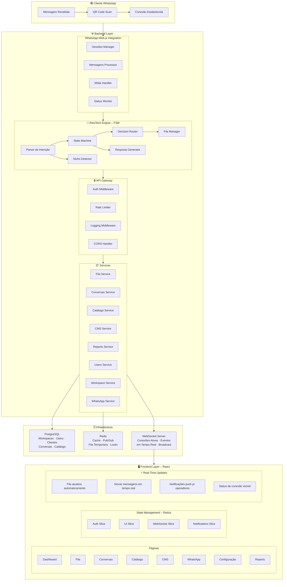
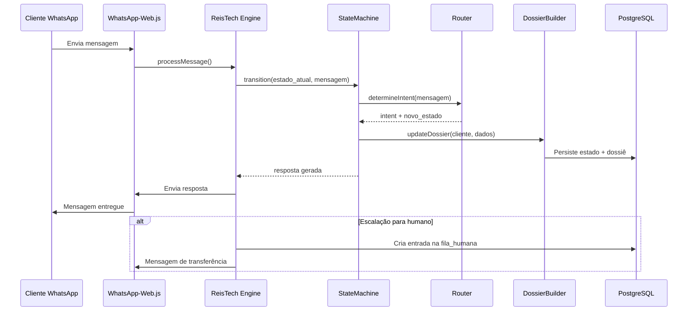
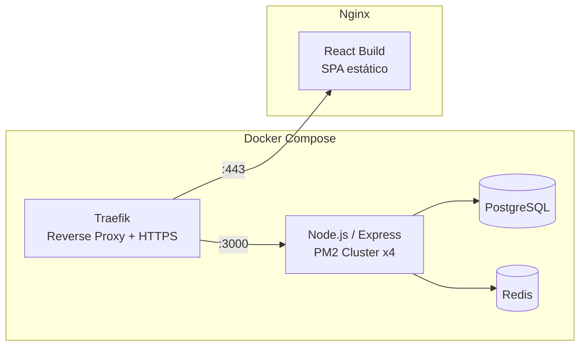

# Arquitetura do Sistema ReisTech v2.0

> Versão Mermaid do diagrama de arquitetura. Substitui `diagrama_arquitetura_sistema.txt`.

## Visão Geral

```mermaid
graph TB
  subgraph CLIENTE["🟢 Cliente WhatsApp"]
    MSG[Mensagem Recebida] --> QR[QR Code Scan] --> CONN[Conexão Estabelecida]
  end

  CLIENTE --> WHATSAPP_LAYER

  subgraph BACKEND["⚙️ Backend Layer"]

    subgraph WHATSAPP_LAYER["WhatsApp-Web.js Integration"]
      SESS[Sessões Manager]
      MSGP[Mensagens Processor]
      MEDIA[Mídia Handler]
      STATUS[Status Monitor]
    end

    WHATSAPP_LAYER --> FSM

    subgraph FSM["🤖 ReisTech Engine – FSM"]
      PARSER[Parser de Intenção] --> SM[State Machine] --> ROUTER[Decision Router]
      PARSER --> NICHO[Nicho Detector]
      SM --> RESP[Resposta Generator]
      ROUTER --> FILA_MGR[Fila Manager]
    end

    FSM --> GATEWAY

    subgraph GATEWAY["🔒 API Gateway"]
      AUTH_MW[Auth Middleware]
      RATE[Rate Limiter]
      LOG_MW[Logging Middleware]
      CORS_H[CORS Handler]
    end

    GATEWAY --> SERVICES

    subgraph SERVICES["📦 Services"]
      FILA_SVC[Fila Service]
      CONV_SVC[Conversas Service]
      CAT_SVC[Catálogo Service]
      CMS_SVC[CMS Service]
      REP_SVC[Reports Service]
      USR_SVC[Users Service]
      WS_SVC[Workspace Service]
      WA_SVC[WhatsApp Service]
    end
  end

  SERVICES --> PG
  SERVICES --> REDIS
  SERVICES --> WS_SERVER

  subgraph INFRA["🗄️ Infraestrutura"]
    PG["PostgreSQL<br/>Workspaces · Users · Clientes<br/>Conversas · Catálogo"]
    REDIS["Redis<br/>Cache · Pub/Sub<br/>Fila Temporária · Locks"]
    WS_SERVER["WebSocket Server<br/>Conexões Ativas · Eventos<br/>em Tempo Real · Broadcast"]
  end

  WS_SERVER --> FRONTEND

  subgraph FRONTEND["🖥️ Frontend Layer – React"]

    subgraph PAGES["Páginas"]
      DASH[Dashboard]
      FILA_PG[Fila]
      CONV_PG[Conversas]
      CAT_PG[Catálogo]
      CMS_PG[CMS]
      WA_PG[WhatsApp]
      CFG_PG[Configuração]
      REP_PG[Reports]
    end

    subgraph STATE["State Management – Redux"]
      AUTH_SL[Auth Slice]
      UI_SL[UI Slice]
      WS_SL[WebSocket Slice]
      NOTIF_SL[Notifications Slice]
    end

    subgraph REALTIME["⚡ Real-Time Updates"]
      RT1["Fila atualiza automaticamente"]
      RT2["Novas mensagens em tempo real"]
      RT3["Notificações push p/ operadores"]
      RT4["Status de conexão visível"]
    end
  end
```

## Fluxo FSM Detalhado

```mermaid
sequenceDiagram
    participant C as Cliente WhatsApp
    participant WA as WhatsApp-Web.js
    participant RT as ReisTech Engine
    participant SM as StateMachine
    participant R as Router
    participant DB as DossierBuilder
    participant PG as PostgreSQL

    C->>WA: Envia mensagem
    WA->>RT: processMessage()
    RT->>SM: transition(estado_atual, mensagem)
    SM->>R: determineIntent(mensagem)
    R-->>SM: intent + novo_estado
    SM->>DB: updateDossier(cliente, dados)
    DB->>PG: Persiste estado + dossiê
    SM-->>RT: resposta gerada
    RT->>WA: Envia resposta
    WA->>C: Mensagem entregue

    alt Escalação para humano
        RT->>PG: Cria entrada na fila_humana
        RT->>WA: Mensagem de transferência
    end
```

## Diagrama de Deploy

```mermaid
graph LR
  subgraph Docker["Docker Compose"]
    APP[Node.js / Express<br/>PM2 Cluster x4]
    PG_C[(PostgreSQL)]
    REDIS_C[(Redis)]
    TRAEFIK[Traefik<br/>Reverse Proxy + HTTPS]
  end

  subgraph Static["Nginx"]
    FRONT[React Build<br/>SPA estático]
  end

  TRAEFIK -->|:443| FRONT
  TRAEFIK -->|:3000| APP
  APP --> PG_C
  APP --> REDIS_C
```
